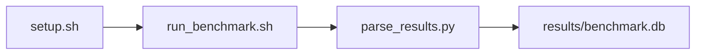

# BERT Inference Sweep Benchmark

[](LICENSE)
[](.github/workflows/ci.yml)

Target: Ubuntu 26.04 · AMD · see Hardware Requirements. This is a host benchmark, not a laptop `pip install` project.

## Quick Start

```bash
git clone https://github.com/garys-gpu-benchmarks/323-gpu-bench-amd-bert-base-inference-ubu2604.git
cd 323-gpu-bench-amd-bert-base-inference-ubu2604
sudo bash setup.sh --assume-yes
bash run_benchmark.sh --profile smoke --validate
```
Results are written to `results/benchmark.db` and `results/summary.json`.

This workload is executed on the validation host after the repository is copied there. `setup.sh` and `run_benchmark.sh` do not open an outbound SSH session.

Prerequisites: Ubuntu 26.04; AMD; Python 3.14.4; root or sudo for `setup.sh`. Framework: Bash, SQLite, Python, PyYAML, ROCm Runtime, PyTorch-ROCm, Hugging Face Transformers, BERT. Set HF_TOKEN when the model license requires a Hugging Face token. This is a host benchmark, not a laptop `pip install` project.



## 1. Overview

Runs Hugging Face BertModel.from_pretrained(model_name) on synthetic token ids. sequence_len, batch_size, warmup_iters, num_iterations, model_name, and dtype (fp16 when '16' is in yaml) come from yaml. precision, num_gpus, and prompt_source are ignored. Latency percentiles equal the mean. Sweep dimensions: model_name, dtype, precision, num_gpus, prompt_source, sequence_len, batch_size, warmup_iters.

## 2. What It Validates

- Validates sequences/s, tokens/s, and peak memory from inline HF BERT. This is not TensorFlow
- #1: Inference throughput (sequences_per_sec); is present and physically sensible.
- #2: Inference latency, mean step time, ms (mean_latency_ms); is present and physically sensible.
- #3: Token throughput (tokens_per_sec); is present and physically sensible.
- #4: Peak GPU memory (peak_gpu_memory_gb) is present and physically sensible.

## 3. Metrics Captured

- **#1: Inference throughput** — stored as `sequences_per_sec`.
- **#2: Inference latency, mean step time, ms** — stored as `mean_latency_ms`.
- **#3: Token throughput** — stored as `tokens_per_sec`.
- **#4: Peak GPU memory** — stored as `peak_gpu_memory_gb`.

## 4. Hardware Requirements

### Supported environment

- OS: Ubuntu 26.04
- GPU vendor: AMD
- Framework family: Bash, SQLite, Python, PyYAML, ROCm Runtime, PyTorch-ROCm, Hugging Face Transformers, BERT
- Python: Python 3.14.4

### Reference validation environment

The tables below describe the machine used to generate the reference results. They are not a requirement that every user buy that exact cloud instance.

### System

Ubuntu 26.04 / AMD / Bash, SQLite, Python, PyYAML, ROCm Runtime, PyTorch-ROCm, Hugging Face Transformers, BERT

### GPU

Ubuntu 26.04 / AMD / Bash, SQLite, Python, PyYAML, ROCm Runtime, PyTorch-ROCm, Hugging Face Transformers, BERT

## 5. Software Requirements

| Component | Version |
|---|---|
| OS | Ubuntu 26.04 |
| Kernel | kernel 7.0.0 |
| Python | Python 3.14.4 |
| ROCm | ROCm 7.14 |
| rocBLAS | N/A - rocBLAS not used |

Runs Hugging Face BertModel.from_pretrained(model_name) on synthetic token ids. sequence_len, batch_size, warmup_iters, num_iterations, model_name, and dtype (fp16 when '16' is in yaml) come from yaml. precision, num_gpus, and prompt_source are ignored.

## 6. Installation

```bash
Run inline transformers.BertModel.from_pretrained on synthetic token batches
```

## 7. Running the Benchmark

```bash
Run inline transformers.BertModel.from_pretrained on synthetic token batches
```

**Validating results separately:**

```bash
export BENCHMARK_PYTHON=/usr/bin/python3.13  # optional
python3 -m venv .venv
source ".venv/bin/activate"
".venv/bin/python" scripts/validate_results.py
```

## 8. Output

### `results/benchmark.db` (SQLite)

CSV with one configuration row. A single row is duplicated to two samples

sample_index,batch_size,sequence_len,sequences_per_sec,p50_latency_ms,mean_latency_ms,p95_latency_ms,p99_latency_ms,tokens_per_sec,peak_gpu_memory_gb
0,1,32,80,12.5,12.5,12.5,12.5,2560,2.0

```bash
Run inline transformers.BertModel.from_pretrained on synthetic token batches
```

### `results/summary.json`

Consolidated metrics from the most recent run — suitable for CI artifact upload or dashboard ingestion.

### `results/raw/<timestamp>.txt`

CSV with one configuration row. A single row is duplicated to two samples

sample_index,batch_size,sequence_len,sequences_per_sec,p50_latency_ms,mean_latency_ms,p95_latency_ms,p99_latency_ms,tokens_per_sec,peak_gpu_memory_gb
0,1,32,80,12.5,12.5,12.5,12.5,2560,2.0

## 9. Baselines / Thresholds

Expected ranges and gates live in `config/benchmark_config.yaml` under `baselines:` or `thresholds:`. To update them, edit that file — never edit validation code directly.

## 10. Troubleshooting

**`setup.sh` missing collector**
Create cannot finish without `scripts/collect_workload.py`.

**`self_check` overlay rewritten**
Do not overwrite files listed in `results/overlay_lock.json`.

**Remote SSH drop during setup**
Reconnect and resume `bash setup.sh --assume-yes`. Do not wipe `.venv` or `.cache`.

## 11. NVIDIA H100 Coding Differences

Primary target is AMD ROCm. NVIDIA notes in this section are reference only and are not the execution path.

## Repository layout

```text
.
├── setup.sh
├── run_benchmark.sh
├── benchmark_specification.json
├── config/
├── scripts/
├── src/
├── tests/
├── docs/
├── results/
└── LICENSE
```
